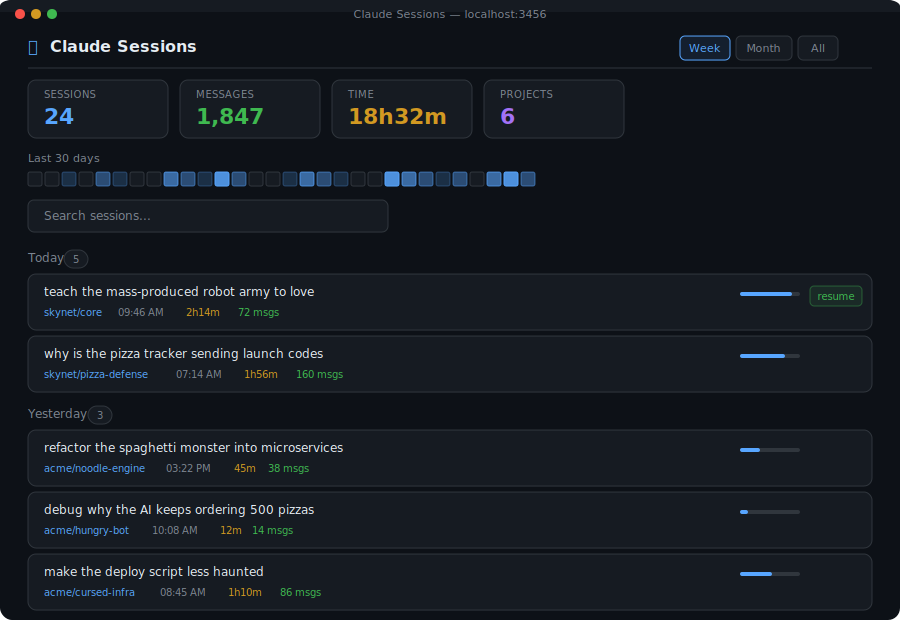

# Claude Sessions

Visual dashboard for [Claude Code](https://docs.anthropic.com/en/docs/claude-code) session history.

Browse, search, read, resume, and delete your Claude Code sessions from a clean web UI.

 

## Preview

<p align="center">
  
</p>

## Features

- **Session list** — all sessions across all projects, grouped by day
- **Search** — filter by project name or first message
- **Conversation viewer** — click any session to read the full chat
- **Resume** — copies `cd <dir> && claude --resume <id>` to your clipboard
- **Delete** — two-click confirm to remove finished sessions
- **Activity heatmap** — 30-day overview at a glance
- **Week / Month / All** time range filters

## Quick Start

```bash
git clone https://github.com/bjergsen243/claude-sessions.git
cd claude-sessions
npm start
# Open http://localhost:3456
```

No dependencies. Just Node.js 18+.

## Configuration

Copy `.env.example` to `.env` and adjust:

```bash
cp .env.example .env
```

| Variable | Default | Description |
|---|---|---|
| `PORT` | `3456` | Server port |
| `CLAUDE_CONFIG_DIR` | `~/.claude` | Path to your Claude Code config directory |
| `READONLY` | `false` | Set to `true` to disable session deletion |

## Docker

```bash
# Build and run
docker compose up -d

# Or with custom config dir
CLAUDE_CONFIG_DIR=/path/to/.claude docker compose up -d
```

The container mounts your `.claude` directory as read-only by default.

## How It Works

Claude Code stores session data as JSONL files in `~/.claude/projects/<encoded-path>/`. Each file is a complete conversation with timestamps, messages, and tool calls.

The dashboard:
1. Scans all project directories on each request (no caching, always fresh)
2. Extracts metadata (start time, duration, message count, first prompt)
3. Strips internal XML tags (system reminders, task notifications, IDE events)
4. Resolves encoded project paths back to real filesystem paths

## License

MIT
